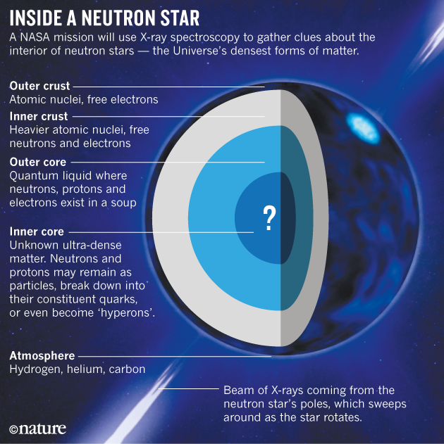
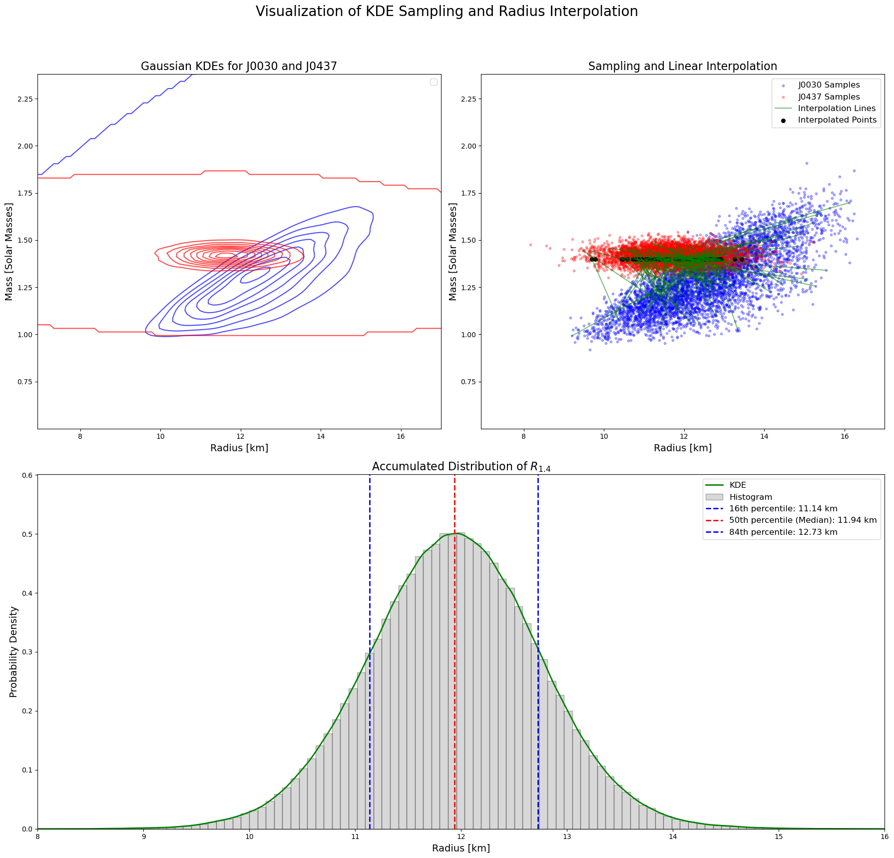
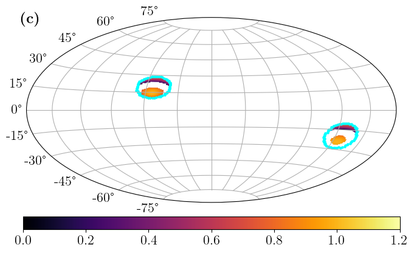
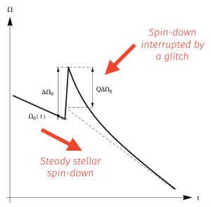
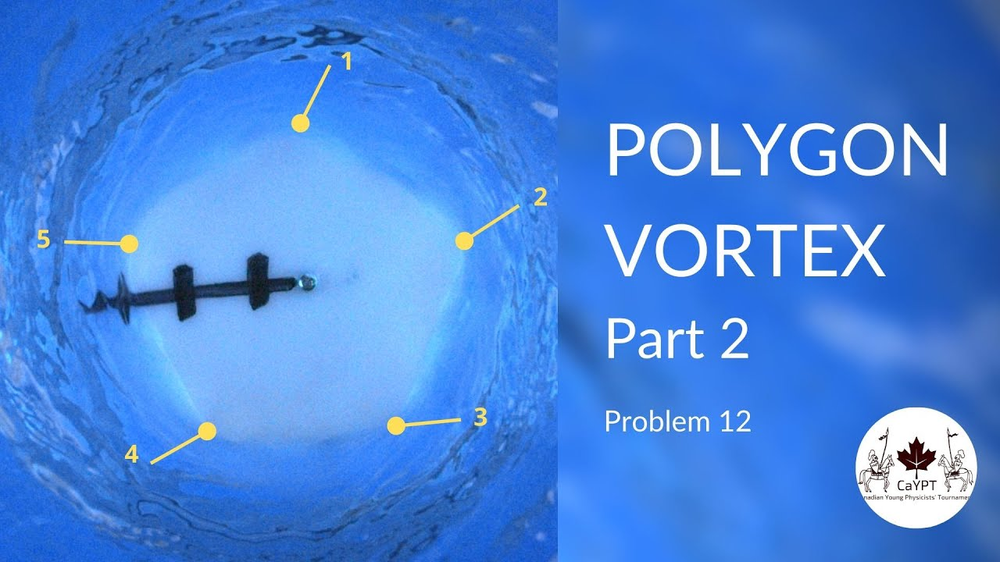
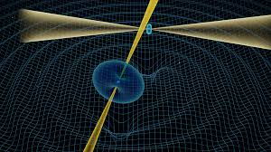

My research interests have evolved significantly from my undergraduate studies to my PhD, as I have actively explored various areas within astrophysics and physics. Below, I outline my primary research areas, highlighting my contributions and collaborations.

## 1. Bayesian Inference of Equation of State

I have developed a strong interest in applying mass-radius measurements and other astrophysical constraints to determine the equation of state (EOS) of neutron stars. My research is among the first to apply these constraints to physics-motivated EOS models using Bayesian inference. Collaborating with Prof. Anna Watts and her group, as well as nuclear physicists such as Prof. Laura Tolos and Prof. Constança Providência, I have focused on applying Bayesian inference to Relativistic Mean Field (RMF) theory models.

**Key Publications:**
- **Chun Huang**, Geert Raaijmakers, Anna Watts, Laura Tolos, Constança Providência, “Constraining a relativistic mean field model using neutron star mass–radius measurements I: nucleonic models”, Monthly Notices of the Royal Astronomical Society, Volume 529, Issue 4, April 2024, Pages 4650–4665, [https://doi.org/10.1093/mnras/stae844](https://doi.org/10.1093/mnras/stae844).
- **Chun Huang**, Laura Tolos, Constança Providência, and Anna Watts, “Constraining a relativistic mean field model using neutron star mass-radius measurements II: Hyperonic models”, Monthly Notices of the Royal Astronomical Society, 2024, [https://academic.oup.com/mnras/advance-article/doi/10.1093/mnras/stae2792/7929867](https://academic.oup.com/mnras/advance-article/doi/10.1093/mnras/stae2792/7929867) .
- **Chun Huang**, Shashwat Sourav, "Constraining first-order phase transition inside neutron stars with application of Bayesian techniques on PSR J0437-4715 NICER data", [arXiv: 2502.11976](https://arxiv.org/abs/2502.11976), (2025), Submitted to *ApJ*.

This research started during the pandemic and has spanned a significant period. I attended a summer school at Northwestern University, where I developed a Bayesian inference package named [**CompactObject**](https://github.com/ChunHuangPhy/CompactObject). This open-source package is designed for Bayesian inference on EOS constraints, featuring a user-friendly and extensible structure. Initially led by me, the project has since expanded through collaborations with researchers from the EU, China, and Washington University. The package now supports seven different EOS models, ranging from phenomenological to meta-models, making it a powerful tool in the community.

**Key Publication:**
- **Chun Huang**, Tuhin Malik, João Cartaxo, Shashwat Sourav, Wenli Yuan, Tianzhe Zhou, Xuezhi Liu, John Groger, Xieyuan Dong, Nicole Osborn, Nathan Whitsett, Zhiheng Wang, Constança Providência, Micaela Oertel, Alexander Y. Chen, Laura Tolos, and Anna Watts, “[CompactObject: An open-source Python package for full-scope neutron star equation of state inference](https://arxiv.org/abs/2411.14615)”, arXiv:2411.14615 (2024), submitted to *JOSS*.

The survey paper on CompactObject is currently in progress. I have also utilized this package to assist physicists worldwide in inferring various EOS models.

**Additional Collaboration:**
- Wenli Yuan, **Chun Huang**, Chen Zhang, Enping Zhou, Renxin Xu, “[Bayesian inference of strangeon matter using the new measurement of J0437-4751 and GW190814](https://arxiv.org/abs/2411.14938)”, arXiv:2411.14938 (2024), submitted to *PRD*.

Ongoing collaborations aim to constrain dark matter, nuclear parameterized EOS, and phase transitions.

## 2. Inference Methods Independent of Equation of State Assumptions

This emerging field represents a significant expansion of my research portfolio. I have developed novel tools and approaches to analyze observational data independently of EOS assumptions, addressing common critiques when presenting my work. This method allows for the inference of critical quantities that are of broad interest across various physics communities, including nuclear physics, gravitational wave physics, and astrophysics.

This research has culminated in my first single-author paper, marking my establishment as an independent researcher in this field.

**Key Publication:**
- **Chun Huang**, “Equation of State Independent Determination on the Radius of a 1.4 $M_{\odot}$ Neutron Star Using Mass-Radius Measurements” (2024), *The Astrophysical Journal Letters*, Volume 978, Number 1, [https://iopscience.iop.org/article/10.3847/2041-8213/ad9f3c](https://iopscience.iop.org/article/10.3847/2041-8213/ad9f3c).

Further work in EOS-independent inference is underway, in collaboration with an undergraduate student at Washington University and Prof. Alex Chen.

## 3. Physics-Motivated X-ray Hotspot Modeling

This research is an integral part of my PhD thesis, focusing on modeling X-ray hotspots using X-ray pulse profile data from [NICER](https://heasarc.gsfc.nasa.gov/docs/nicer/) observations. In collaboration with Prof. Alex Chen at Washington University, the key motivation behind this work is to move beyond the reliance on meta hotspot models, which often lack systematization. Instead, I aim to employ phenomenological force-free hotspot models to perform inferences on pulse profile data.

I have developed a comprehensive pipeline for this inference process, which is profound in its ability to connect the neutron star's interior, surface, and exterior into a cohesive framework using solely X-ray observations. This holistic approach allows us to solve complex interactions within the neutron star system. Future plans include extending this methodology to incorporate multi-wavelength constraints and adapting it to handle arbitrary magnetic field configurations.

**Key Publication:**
- **Chun Huang**, Alexander Y. Chen, "Physics motivated models of pulsar X-ray hotspots: off-center dipole configurations", (2024) in preparation.

## 4. Glitch Dynamics

Pulsar glitches are fundamental phenomena characterized by sudden increases in a pulsar's spin rate. These abrupt changes are typically accompanied by phenomena such as delayed spin-up and persistent shifts in the spin-down rate. To investigate these dynamics, I have delved into the literature and analyzed radio observation data of the Crab pulsar's glitches. In collaboration with Prof. Xiaoping Zheng at Central China Normal University, my work focuses on examining different theoretical models of pulsar glitches through data analysis.

**Key Publication:**
- **Chun Huang** and Xiaoping Zheng, “[Bayesian Insights into post-Glitch Dynamics: Model comparison and parameter constraint from decades-long observation data of the Crab pulsar](https://arxiv.org/abs/2409.18432)”, arXiv:2409.18432 (2024).

Additionally, I am interested in the theoretical modeling of glitch behavior using superfluid theory. Part of my undergraduate thesis is dedicated to this topic, where we examine past starquake models with new datasets. This work is currently being prepared for publication.

**Key Publication:**
- Xiaoping Zheng, WeiHua Wang, **Chun Huang**, and Jianping Yuan, “The unprecedentedly persistent spin-down increase of the Crab pulsar rules out external torque variations due to starquakes”, submitted to *ApJ*.

## 5. Other Fields

I maintain a persistent interest in nonlinear dynamics and fluid dynamics. A significant part of my undergraduate experience involved studying fluid dynamics with fellow students at Central China Normal University (CCNU). One of our projects, which investigated a fascinating phenomenon named "Polygon vortex," has been summarized in an [arXiv submission](https://arxiv.org/abs/2108.09486), although it has not yet been published.

- **Chun Huang** and Yuchen Jiang, “[Symmetry breaking Paradigm In Typical Laminar-Turbulence Transition System](https://arxiv.org/abs/2108.09486)”, arXiv:2108.09486 (2020).

I am also interested in other fluid dynamics physics problems and astrophysical observations in the X-ray band. I have collaborated with Prof. Michael Nowak on studying double pulsar systems. Currently, I am actively working with a colleague at Purple Mountain Observatory to perform observational constraints on double pulsar systems.

---

