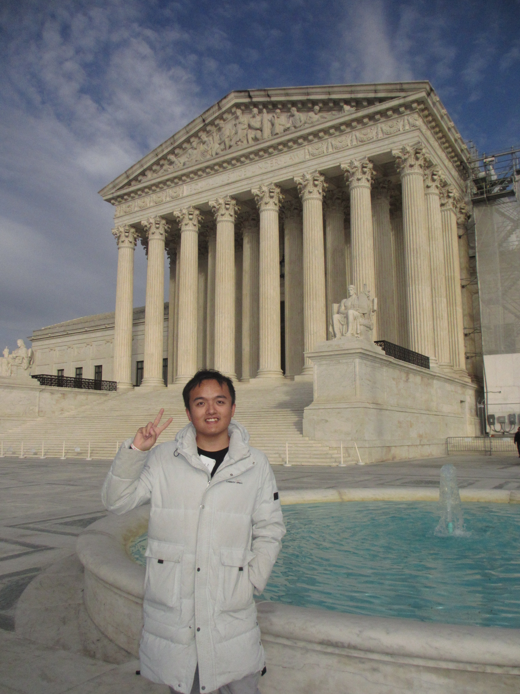

I am a third-year PhD candidate in the [Physics and Astronomy Department at Washington University in St. Louis](https://physics.wustl.edu) working with [Alex Chen](https://physics.wustl.edu/people/alex-chen), [Yajie Yuan](https://physics.wustl.edu/people/yajie-yuan), and [Michael Nowak](https://physics.wustl.edu/people/michael-nowak). I am currently interested in constructing a physical understanding of X-ray hotspot configurations using X-ray timing data from [NICER](https://heasarc.gsfc.nasa.gov/docs/nicer/) and [XMM-Newton](https://www.cosmos.esa.int/web/xmm-newton). Additionally, I utilize the inferred mass-radius measurements from these analyses, along with multimessenger observations and nuclear physics input, to constrain the neutron star interior. 

I am the leader and developer of a collaborative Bayesian inference package for neutron star physics, working with over 10 scientists from the US, EU, and China: [CompactObject](https://github.com/ChunHuangPhy/CompactObject).

Before coming to the US to pursue my PhD, I completed my undergraduate studies in the [Physics Department at Central China Normal University](http://physics.ccnu.edu.cn/English.htm). I also worked remotely with the XPSI group at the University of Amsterdam as an Undergraduate Intern under advising of [Prof. Anna Watts](https://staff.fnwi.uva.nl/a.l.watts/).

Prior to beginning my undergraduate studies in Wuhan, China, I was born and grew up in the small city Jishou in Hunan Province. My entire education before college, from primary school to the final years of high school, all completed in my beloved hometown. I am the first in my family to attend college, and with pride, I finally leave my small city, stepping into a vast world to pursue my dreams. In my hometown, I lived a life of unparalleled joy, immersed in the breathtaking mountain landscapes of this charming city and surrounded by steadfast friends, and I beleive we will be friends forever. These experiences, reminiscent of memories from another life, give me endless courage.

Before all of this, I was stardust—a cluster of supernova remnants dancing through the universe. 
